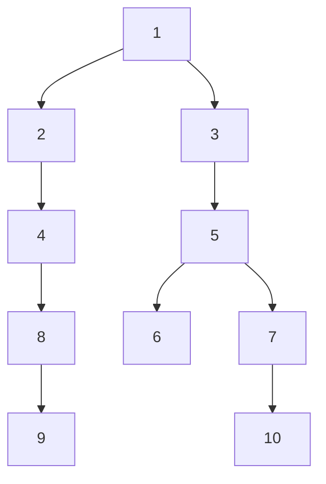
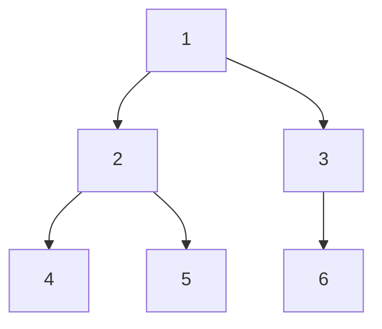
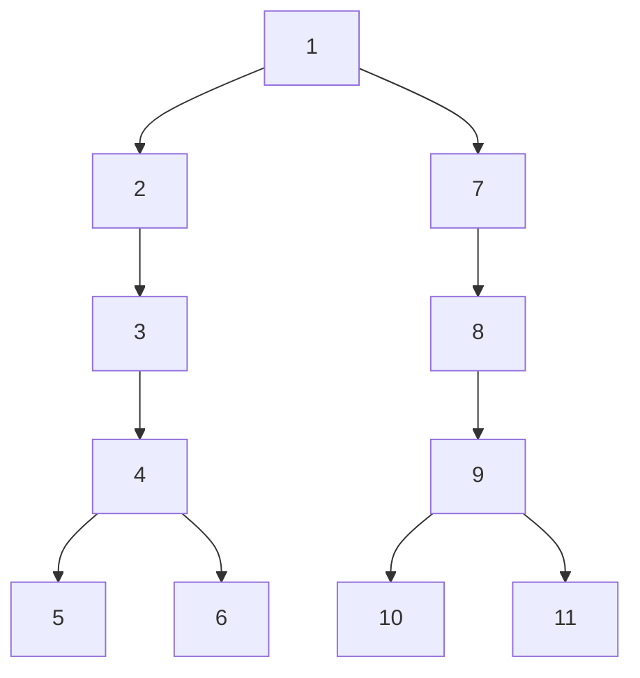

## Data Structure

- tree is graph which is acyclic(no cycles) and connected
- terms: root, childern, parent, ancestors, leaf node, subtree

here 1 is root.
2 and 3 are its children.
its parent of 2 and 3. 
10,3 and 9 are leaf nodes. 
5, 3 and 1 are ancestors of 6. 
3,5,6,7,10 forms the subtree of node 3. 

- terms2: binary tree
	- full BT: every node has 0/2 children 
	- complete BT: all levels filled except bottom level, bottom level has nodes on left side
	- perfect BT: all leaf nodes at same level
	- balance BT: $height(left\_node, right\_node) \leq 1$
	- degenerate BT: like a linked list, linear, every node has single children
- binary search tree: all nodes on the left subtree less than the node and all nodes on the right subtree are greater than the node.
- Representation of tree
```cpp
using data_t = int;
struct node_t{
	data_t data;
	node_t* left;
	node_t* right;
};

//or
template<typename T>
struct Node {
	T data;
	Node* left;
	Node* right;
	Node* parent;
	Node():left(NULL), right(NULL), parent(NULL), data(T()) {}
	Node(T data_): left(NULL), right(NULL), parent(NULL), data(data_) {}
};
```
## Tree traversals
- all traversals are $\mathcal{O}(N)$ in time and space.
- breadth first search or level order traversal
```cpp
void bfs(node_t* root, function<void(data_t)>& f){
	if(root == NULL)
		return;
	
	queue<node_t*> q;
	q.push(root);
	while(!q.empty()){
		node_t node = q.front();
		f(node->data);
		if(node->left != NULL) q.push(node->left);
		if(node->right != NULL) q.push(node->right);
		q.pop();
	}
}
//bfs with level info
vector<vector<data_t>> bfs(node_t* root){
	vector<vector<data_t>> ans;
	if(root == NULL)
		return ans;
	
	queue<node_t*> q;
	q.push(root);
	while(!q.empty()){
		int q_size = q.size();
		vector<data_t> level;
		for(int i=0; i<q_size; ++i){
			node_t* node = q.front();
			if(node->left != NULL) q.push(node->left);
			if(node->right != NULL) q.push(node->right);
			q.pop();
			level.push_back(node->data);
		}
		ans.push_back(level);
	}
	return ans;
}
```
- depth first search
```cpp
//recusrive are O(height) but in worst case height = N so O(N)
void preOrder(node_t* root, const function<void(data_t)>& f){
	if(root == NULL)
		return;
	f(root->data);
	preOrder(root->left, f);
	preOrder(root->right, f);
}

void postOrder(node_t* root, const function<void(data_t)>& f){
	if(root == NULL)
		return;
	postOrder(root->left, f);
	postOrder(root->right, f);
	f(root->data);
}

void inOrder(node_t* root, const function<void(data_t)>& f){
	if(root == NULL)
		return;
	inOrder(root->left, f);
	f(root->data);
	inOrder(root->right, f);
}

//iterative versions
void preOrder(node_t* root, const function<void(data_t)>& f){
	if(root == NULL)
		return;
	stack<node_t*> stk;
	stk.push(root);
	while(!stk.empty()){
		auto node = stk.top();
		stk.pop();
		f(node->data);
		if(node->right != NULL) stk.push(node->right);
		if(node->left != NULL) stk.push(node->left);
	}
}

template<typename Functor>
void inOrder(node_t* root, Fuctor&& f){
	stack<node_t*> stk;
	node_t* node = root;
	while(1){
		if(root != NULL){
			stk.push(root);
			node = node->left;
		}
		else if(!stk.empty()){
			node = stk.top(); stk.pop();
			f(node->data);
			node = node->right;
		}
		else
			return;
	}
}


void postOrder(node_t* root, const function<void(data_t)>& f){
	stack<node_t*> stk;
	while(1){
		if(root != NULL){
			stk.push(root);
			root = root->left;
		}
		else if(!stk.empty()){
			node_t* tmp = stk.top();
			if(tmp->right != NULL)
				root = tmp->right;
			else{
				stk.pop();
				f(tmp->data);
				while(!stk.empty() && stk.top()->right== tmp){
					tmp = stk.top();
					stk.pop();
					f(tmp->data);
				}
			}
		}
		else 
			return;
	}
}

//inorder, preorder, postorder all at onces
using list_t = vector<int>
tuple<list_t, list_t, list_t> prePostIn(node_t* root){
	stack<pair<node_t*, int>> stk;
	stk.push({root, 1});
	vector<int> pre, in, post;
	while(!stk.empty()){
		auto it = stk.top();
		stk.pop();
		if(it.second == 1){
			pre.push_back(it.first);
			it.second++;
			stk.push(it);
			if(it.first->left != NULL)
				stk.push({it.first->left, 1});
		}
		else if(it.second == 2){
			in.push_back(it.first);
			it.second++;
			stk.push(it);
			if(it.first->right != NULL)
				stk.push({it.first->right, 1});
		}
		else
			post.push_back(it.first);
	}
	return make_tuple(pre,in,post);
}
```


## Binary Search Trees
- operations: search, min, max, successor, predecessor, insert, delete all in $\mathcal{O}(height)$
- need extra 2n space for left and right child pointers
- **BST property**:	for a node x, $x.left <x < x.right$
- for duplicates, either track a counter of duplicates or change condition as L <= node < R
- usually height is kept roughly $\lg N$ with techniques like AVL trees	 or RB trees
### BST Operations
- successor: if right node not-null return it, else lowest right child of left child of the node; similar way predecessor
```cpp
node_t* successor(node_t* node){
	if(node->right == NULL) 
		return NULL;
	
	auto righty = node->righty;
	while(righty->left != NULL) 
		righty = righty->left;
	return righty;

}
node_t* predecessor(node_t* node){
	if(node->left == NULL) 
		return NULL;
	
	auto lefty = node->left;
	while(lefty->right != NULL) 
		lefty = lefty->right;
	return lefty;
}

node_t* min(node_t* root){
	if(root == NULL)
		return NULL;
	
	while(root->left != NULL)
		root = root->left;
	
	return root;
}

node_t* max(node_t* root){
	if(root == NULL)
		return NULL;
	
	while(root->right != NULL)
		root = root->right;
	
	return root;
}
```
- insert
```cpp
void insert(node_t* root,data_t data){
	if(root == NULL)
		root = new node_t(data);
	else if(root->data > data)
		insert(root->left, data);
	else 
		insert(root->right,data);
}
//iterative
node_t* insert(node_t* root,data_t data){
	if(root == NULL){
		root = new node_t(data);
		return root;
	}
	auto node = root;
	while(1){
		if(node->data > data){
			if(node->left)
				node = node->left;
			else{
				node->left = new node_t(data);
				break;
			}
		}
		else if(node->data < data){
			bool s = node->data == 4;
			if(node->right)
				node = node->right;
			else{
				node->right = new node_t(data);
				break;
			}
		}
		//if we don't want to modify bst if data exist already in it
		else
			break;
	}
	return root;
}

```
- delete: has three cases: leaf, node with one child, node with two child
```cpp
node_t* delete(node_t* root, data_t data){
	if(root == NULL) 
		return root;
	else if(data < root->data) 
		root->left = delete_node(root->left, data);
	else if(data > root->data) 
		root->right = delete_node(root->right, data);
	else if(root->left == NULL && root->right == NULL){ // Case 1
		delete root;
		root = NULL;
	}
	else if(root->left == NULL){ // Case 2
		node* temp = root;
		root= root->right;
		delete temp;
	}
	else if(root->right == NULL){ // Case 2
		node* temp = root;
		root = root->left;
		delete temp;
	}
	else{ // Case 3: 
		//place successor value at node and delete original successor node
		node* temp = root->right;
		while(temp->left != NULL) 
			temp = temp->left;
		root->data = temp->data;
		root->right = delete_node(root->right, temp->data);
	}
	return root;
}
```


## Questions
### Check if two binary trees are same
```cpp
bool sameTree(node root1, node root2){
	if(root1 == NULL || root2 == NULL)
		return root1 == root2;
	if(root1->data == root2->data
		&& sameTree(root1->left,root2->left)
		&& sameTree(root1->right, root2->right))
		return true;
}
```

### Check if BT is balanced
```cpp
bool isBalanced(node_t* root){
	return check(root) != -1;
}
int check(node_t* root){
	if(root == NULL)
		return 0;
	
	int lh = height(root->left), rh = height(root->right);
	if(lh == -1 || rh == -1 || abs(lh-rh) > 1) return -1;
	return 1 + max(lh, rh);
}
```

### Maximum depth/height or tree
- at any node answer is  = 1 + max(height of left node, height of right node)
```cpp
int height(node_t* root){
	if(root == NULL)
		return 0;
	
	return 1 + max(height(root->left), height(root->right));
}
```

### Diameter of binary tree
- diameter: longest path between any two nodes
```cpp
int diameter(node_t* root){
	int maxi = 0;
	diameter_helper(root, maxi);
	return maxi;
}

int diameter_helper(node_t* root, int& maxi){
	if(root == NULL)
		return 0;
	int lh = diameter_helper(root->left, maxi);
	int rh = diameter_helper(root->right, maxi);
	maxi = max(maxi, lh+rh);
	return 1 + max(lh, rh);
}
```

### Maximum path sum
- naive way: maximum of (lh+rh) for every node
```cpp
int max_path(node_t* root){
	int maxi = INT_MIN;
	max_path_helper(root, maxi);
	return maxi;
}
int max_path_helper(node_t* root, int& maxi){
	if(root == NULL)
		return 0;
	int lSum = max(0, max_path_helper(root->left, maxi));
	int rSum = max(0, max_path_helper(root->right, maxi));
	maxi = max(maxi, lSum + rSum);
	
	return root->data + max(lSum, rSum);
}
```
### Zig-zag traversal
- level order traversal alternating directions of traversal of levels(left-right and right-left) for example for this the level order traversal is: 1 2 3 6 5 4  


```cpp
vector<vector<data_t>> zig_zag_traverse(node_t* root){
	vector<vector<data_t>> ans;
	if(root == NULL)
		return ans;
	
	queue<node_t*> q;
	q.push(root);
	
	bool leftToRight = 0;
	while(!q.empty()){
		int q_size = q.size();
		vector<data_t> level(q_size);
		for(int i=0; i<q_size; ++i){
			node_t* node = q.front();
			if(node->left != NULL) q.push(node->left);
			if(node->right != NULL) q.push(node->right);
			q.pop();
			level[leftToRight ? i : q_size - i - 1] = node->data;
		}
		leftToRight = !leftToRight;
		ans.push_back(level);
	}
	return ans;
}
```
### Leaf nodes of the tree
```cpp
bool isLeaf(node_t* node){
	return node->left == NULL && node->right == NULL;
}
void leaves_helper(node_t* root, vector<int>& res){
	if(isLeaf(root)){
		res.push_back(root->data);
		return;
	}
	if(root->left != NULL)
		leaves_helper(root->left, res);
	if(root->right != NULL)
		leaves_helper(root->right, res);
}
vector<int> leaves(node_t* root){
	vector<int> res;
	leaves_helper(root, res);
	return res;
}
```

### Boundary traversal
- for this boundary traversal is: 1 2 3 4 5 6 10 11 9 8 7(anti clockwise)

- so left boundary, then leaf nodes and then reverse of right boundary
```cpp
vector<int> leftBoundary(node_t* root){
	if(root != NULL)
		root = root->left;
	vector<int> res;
	while(root != NULL){
		if(!isLeaf(root))
			res.push_back(root);
		if(root->left != NULL)
			root = root->left;
		else
			root = root->right;
	}
	return res;
}
vector<int> rightBoundary(node_t* root){
	if(root != NULL)
		root = root->right;
	vector<int> res;
	while(root != NULL){
		if(!isLeaf(root))
			res.push_back(root);
		if(root->right != NULL)
			root = root->right;
		else
			root = root->left;
	}
	return res;
}
vector<int> boundary(node_t* root){
	vector<int> res;
	if(root == NULL)
		return res;
	if(!isLeaf(root)) res.push_back(root);
	auto lb = leftBoundary(root);
	auto rb = rightBoundary(root);
	auto lf = leaves(root);
	res.insert(res.end(), lb.begin(), lb.end());
	res.insert(res.end(), lf.begin(), lf.end());
	res.insert(res.end(), rb.rbegin(), rb.rend());
	return res;
}
```
### Vertical order traversal

- we use level order traversal to get the levels and verticals of all nodes

```cpp
vector<vector<int>> vertical_order_traversal(node_t* root){
	if(root == NULL)
		return vector<vector<int>>();
	map<int, map<int, multiset<int>>> res	;
	
	queue<tuple<node_t*, int,int>> q;
	q.push({root, 0, 0});
	while(!q.empty()){
		auto[node, vertical, level] = q.front();
		q.pop();
		res[vertical][level].insert(node->data);
		if(node->left != NULL)
			q.push({node->left, vertical-1, level+1});
		if(node->right != NULL)
			q.push({node->right, vertical+1, level+1});
	}
	vector<vector<int>> ans;
	for(auto lvToNodes: res){
		vector<int> column;
		for(auto nodeSet: lvToNodes.second)
			column.insert(column.end(), 
						  nodeSet.second.begin(), nodeSet.second.end());
		ans.push_back(column);
	}
	return ans;
}

```
### Top view of a tree
```cpp
vector<int> top_view(node_t* root){
	if(root == NULL)
		return vector<int>();

	map<int,int> res;
	queue<pair<node_t*, int>> q;
	q.push({root, 0});
	while(!q.empty()){
		auto[node, vertical] = q.front();
		q.pop();
		if(res.find(vertical) == res.end())
			res[vertical] = node->data;
		if(node->left != NULL)
			q.push({node->left, vertical - 1});
		if(node->right != NULL)
			q.push({node->right, vertical + 1});
	}
	vector<int> ans;
	for(auto x: res)
		ans.push_back(x.second);
	return ans;
}
```
### Bottom view of a tree

```cpp
vector<int> bottom_view(node_t* root){
	if(root == NULL)
		return vector<int>();

	map<int,int> res;
	queue<pair<node_t*, int>> q;
	q.push({root, 0});
	while(!q.empty()){
		auto[node, vertical] = q.front();
		q.pop();
		res[vertical] = node->data;
		if(node->left != NULL)
			q.push({node->left, vertical - 1});
		if(node->right != NULL)
			q.push({node->right, vertical + 1});
	}
	vector<int> ans;
	for(auto x: res)
		ans.push_back(x.second);
	return ans;
}
```

### Right/Left view of a tree
```cpp
vector<int> right_view(node_t* root){
	vector<int> ans;
	right_view_h(root,0,ans);
	return ans;
}
vector<int> left_view(node_t* root){
	vector<int> ans;
	left_view_h(root,0,ans);
	return ans;
}

void right_view_h(node_t* root, int level, vector<int>& ans){
	if(root == NULL)
		return;
	if(level == ans.size())
		ans.push_back(root->data);
	right_view(root->right, level+1);
	right_view(root->left, level+1);
}
void left_view_h(node_t* root, int level, vector<int>& ans){
	if(root == NULL)
		return;
	if(level == ans.size())
		ans.push_back(root->data);
	right_view(root->left, level+1);
	right_view(root->right, level+1);
}
```
### Check if tree is symmetrical
- if tree is symmetrical then Inorder Root-Left-Right traversal of left subtree and Inorder Root-Right-Left traversal of right subtree of root will be same
```cpp
bool is_symmetrical(node_t* root){
	return root == NULL || sym_check_helper(root->left, root->right);
}

bool sym_check_helper(node_t* left, node_t* right){
	if(left == NULL || right == NULL)
		return left == right;
	return left->data == right->data
		&& sym_check_helper(left->left, right->right)
		&& sym_check_helper(left->right, right->left);
		
}
```
### Path from root to a node of tree
```cpp
bool path_from_root_helper(node_t* root, 
								  int node_value, vector<int>& ans){
	if(root == NULL)
		return false;
	
	ans.push_back(root->data);
	if(root->data == node_value
	  || path_from_root_helper(root->left, node_value, ans)
	  || path_from_root_helper(root->right, node_value, ans))
		return true;
	ans.pop_back();
	
	return false;
}


vector<int> path_from_root(node_t* root, int node_value){
	vector<int> ans;
	path_from_root_helper(root, node_value, ans);
	return ans;
}
```

### Lowest common ancestor
- node with mininum height which is ancestor of the given two nodes
```cpp
//if one node is in the tree and other is not then the node in tree is returned
node_t* lca(node_t* root, int node1, int node2){
	if(root == NULL || root->data == node1 || root->data == node2)
		return root;
	
	node_t* left = lca(root->left, node1, node2);
	node_t* right = lca(root->left, node1, node2);
	if(left == NULL)
		return right;
	if(right == NULL)
		return left;
	return root;
}
```

### Maximum width of tree

```cpp
int max_width(node_t* root){
	if(root == NULL)
		return 0;
	queue<pair<node_t*, int>> q;
	q.push({root, 0});
	int max_w = 0;

	int cnt = 0;
	while(!q.empty()){
		int l_lim = q.front().second, q_size=  q.size();
		for(int i=0; i<q_size; ++i){
			auto node = q.front().first;
			int idx = q.front().second - l_lim;
			q.pop();
			if(i == q_size - 1)
				max_w = max(max_w, idx+1);
			if(node->left != NULL)
				q.push({node->left, 2ll*idx + 1 });
			if(node->right != NULL)
				q.push({node->right, 2ll*idx + 2 });
		}
	}
	return max_w;
}

```

### Children sum problem
- make binary tree follow this property: `node->data = node->left->data + node->right->data` for all nodes
- we can increase any node by 1 any number of times to do this
```cpp
void change_tree(node_t* root){
	if(root == NULL)
		return;
	int child_sum = 0;
	child_sum += (root->left) ? root->left->data : 0;
	child_sum += (root->right) ? root->right->data : 0;
	
	if(child < root->data){
		if(root->left)
			root->left->data = root->data;
		if(root->right)
			root->right->data = root->data;
	}
	else 
		root->data = child;
	
	change_tree(root->left);
	change_tree(root->right);
	
	child_sum = 0;
	child_sum += (root->left) ? root->left->data : 0;
	child_sum += (root->right) ? root->right->data : 0;
	if(root->left != NULL or root->right != NULL)
		root->data = child_sum;
}

/*
 * par propagates max value found so far down the tree
 * every node data is updated so that its 
 */
int change_tree_helper(node_t* root,int par){
    if(!root)
        return 0;
    int l = change_tree_helper(root->left, max(root->data,par));
    int r = change_tree_helper(root->right, max(root->data,par));
    root->data = max(l + r, max(root->data, par));
   	return root->data;
}

void change_tree(BinaryTreeNode < int > * root) {
    fun(root,0);
}
```
### Nodes at a distance k
```cpp
map<node_t*, node_t*> parents_of_nodes(node_t* root){
	queue<node_t*> q;
	q.push(root);
	map<node_t*, node_t*> parents;
	while(!q.empty()){
		auto x = q.front();
		q.pop();
		if(x->left != NULL){
			q.push(x->left);
			parents[x->left] = x;
		}
		if(x->right != NULL){
			q.push(x->right);
			parents[x->right] =x;
		}
	}
	return parents;
}

vector<int> distance_k_nodes(node_t* root, node_t* node, int target_dist){
	vector<int> ans;
	if(root == NULL || node == NULL)
		return ans;
	
	auto parents = parents_of_nodes(root);
	unordered_map<node_t*, bool> visited;
	int dist = 0;
	queue<node_t*> q;
	q.push(node);
	visited[node] = true;
	while(!q.empty()){
		if(dist++ == target_dist)
			break;
		int q_size = q.size();
		for(int i=0; i<q_size; ++i){
			auto x = q.front();q.pop();
			for(auto t: {x->left, x->right, parents[x]}) 
				if(t && !visited[t]){
					q.push(t);
					visited[t] = 1;
				}
		}
	}
	while(!q.empty()) {
		auto x = q.front(); q.pop();
		ans.push_back(x->val);
	}
	return ans;
}
```
### Minimum time to burn tree from a node
```cpp
//i case the only node's data is given, not the pointer
node_t* find_node(Node* root, int target){
	if(root == NULL)
		return NULL;
	if(root->data == target)
		return root;
	auto x = find_node(root->left, target);
	if(x != NULL) return x;
	return find_node(root->right, target);
}

vector<int> time_to_burn_from_node(node_t* root, node_t* node){
	if(root == NULL || node == NULL)
		return 0;
	
	auto parents = parents_of_nodes(root);
	unordered_map<node_t*, bool> visited;
	
	int time = 0;
	queue<node_t*> q;
	q.push(node);
	visited[node] = true;
	while(!q.empty()){
		int q_size = q.size();
		bool fl = 0;
		for(int i=0; i<q_size; ++i){
			auto x = q.front();q.pop();
			for(auto t: {x->left, x->right, parents[x]}) 
				if(t && !visited[t]){
					q.push(t);
					visited[t] = 1;
					fl = 1;
				}
		}
		if(fl)
				time++;
	}
	return time;
}
```
### Count nodes in complete binary tree in less than $\mathcal{O}(n)$
- $\mathcal{O}((\lg N)^2)$ solution
```cpp
int left_height(node_t* root){
	int height = 0;
	while(root != NULL)
		height++, root = root->left;
	return height;
}
int right_height(node_t* root){
	int height = 0;
	while(root != NULL)
		height++, root = root->right;
	return height;
}
//O(lgN)^2 solu
int node_count_in_complete_tree(node_t* root){
	if(root == NULL)
		return 0;
	int lh = left_height(root), rh = right_height(root);
	if(lh == rh)
		return 1<<lh - 1;
	return 1 + node_count_in_complete_tree(root->left) +
		node_count_in_complete_tree(root->right);
}
```
### Construct Binary tree from inorder & preorder traversal
```cpp
node_t* construct_h(const vector<int>& pre_order, 
					const vector<int>& in_order,  
					map<int,int>& value_index, 
					int pre_st, int pre_end, int in_st, int in_end){
	if(pre_st == pre_end)
		return NULL;
	node_t* root = new node_t(pre_order[pre_st]);

    /* auto root_ptr = find(in_order.begin()+in_st, in_order.begin()+in_end, root->data); */ 
    /* int root_location = root_ptr - (in_order.begin() + in_st); */
    int root_location = value_index[root->data] - in_st;

	root->left = construct_h(pre_order,in_order , value_index,
							 pre_st+1, pre_st + root_location +1,  
							 in_st, in_st + root_location);
	root->right = construct_h(pre_order,in_order, value_index,
							  pre_st + root_location + 1, pre_end, 
							  in_st + root_location+1 , in_end);
	return root;
}

node_t* construct(const vector<int>& pre_order, const vector<int>& in_order){
    map<int,int> value_index;
    for(int i=0; i<in_order.size(); ++i)
        value_index[in_order[i]] = i;

    return construct_h(pre_order, in_order, value_index, 0, pre_order.size(), 0, in_order.size());
}
```
### Comstruct Binary tree from inorder & postorder traversal
```cpp
node_t* construct_h(const vector<int>& post_order, const vector<int>& in_order,  map<int,int>& value_index, int pre_st, int pre_end, int in_st, int in_end){
	if(pre_st == pre_end)
		return NULL;
	node_t* root = new node_t(post_order[pre_end-1]);

    /* auto root_ptr = find(in_order.begin()+in_st, in_order.begin()+in_end, root->data); */ 
    /* int root_location = root_ptr - (in_order.begin() + in_st); */
    int root_location = value_index[root->data] - in_st;

	root->left = construct_h(post_order,in_order , value_index,
	                       pre_st, pre_st + root_location,  
	                       in_st, in_st + root_location);
	root->right = construct_h(post_order,in_order, value_index,
	                        pre_st + root_location, pre_end-1, 
	                        in_st + root_location+1 , in_end);
	return root;
}

node_t* construct(const vector<int>& in_order, const vector<int>& post_order){
    map<int,int> value_index;
    for(int i=0; i<in_order.size(); ++i)
        value_index[in_order[i]] = i;

    return construct_h(post_order, in_order, value_index, 0, post_order.size(), 0, in_order.size());
}
```
### Serializing and Deserializing a binary tree
```cpp
string serialize(node_t* root){
	if(root == NULL)
		return "";
	string res;
	queue<node_t*> q;
	q.push(root);
	while(!q.empty()){
		auto node = q.front();
		q.pop();
		if(node == NULL)
			res += "#,";
		else{
			res += to_string(node->data) + ",";
			q.push(node->left);
			q.push(node->right);
		}
	}
	return res;
}
node_t* deserialize(string tree_str){
	if(tree_str.size() == 0)
		return NULL;
	
	stringstream s(tree_str);
	string tmp;
	getline(s, tmp, ',');
	node_t* root = new node_t(stoi(tmp)); 
		
	queue<node_t*> q;
	q.push(root);
	while(!q.empty()){
		auto node = q.front(); q.pop();
		
		getline(s, tmp, ',');
		if(s != "#"){
			node->left = new node_t(stoi(temp));
			q.push(node->left);
		}
		getline(s, tmp, ',');
		if(s != "#"){
			node->right = new node_t(stoi(temp));
			q.push(node->right);
		}
	}
	return root;
}
```
### Morris Traversal
- traversal with $\mathcal{O}(n)$ time and $\mathcal{O}(1)$ space using threaded binary tree concept
- idea
    - when you go to left child of the node, find the rightmost node in the left subtree of the node and make its right children point to the node.
    - when there is no left child, process the node and go back.
    - when going back, we may return back to a traversed node. We'll again perform the first case, but this time we'll find that going right and right we come back to the same node. so break that link and progress further.
- for example here
    - we'll first find the rightmost node in left subtree of root, and point its right to the root.
    - now we do the same for  node 2, the rightmost node is 4, make its right point to 2.
    - now since node 4 doesn't have a left child so we follow its right child link.
    - we come back to 2. now if we go right,right,right in its left subtree then we come back to 2 from 4->2 link, so delete that link and process 2.
    - now we proceed in right of node 2. We go to 5, then 6 and then 1.
    - when we go right,right,right in left subtree of node 1, then we come back to node 1 through link 6-->1, so delete that link.
    - now we proceed to right of 1. 3 doesn't have any left or right child, so process it and traversal is done.

	
```cpp
//morris inorder traversal
//should have put root in a temporary variable and then do this thing
template<typename Functor>
void traverse(node_t* root, Functor f){
	while(root != NULL){
		if(root->left != NULL){
			auto rightmost = root->left;
			while(rightmost->right != NULL && rightmost->right != root)
				rightmost = rightmost->right;
			if(rightmost->right == root){
				rightmost->right = NULL;
				f(root); //x
				root = root->right;
			}
			else{
				rightmost->right = root;
				//y
				root = root->left;
			}
		}
		else{
			f(root);
			root = root->right;
		}
	}
}
//one liner change to convert it to preorder: place line x to line y
```

### Flatten binary tree to linked list in-place
```cpp
//O(N) in time and O(h) space, for inorder, doubly
Node *head = NULL, *previ = NULL;
void flatten(Node* root){
	if(root == NULL)
		return;

	helper(root->left);
	if(previ == NULL){
		head = root;
	}
	else{
		previ->right = root;
		root->left = previ;
	}
	previ = root;
	helper(root->right);
}


//morris traversal O(1) in space, preorder, singly
void flattern(node_t* root){
	auto curr = root;
	while(curr != NULL){
		if(curr->left != NULL){
			auto rightmost = curr->left;
			while(rightmost->right != NULL)
				rightmost = rightmost->right;
			rightmost->right = curr->right;
			curr->right = curr->left;
			curr->left = NULL;
		}
		//when curr->left is not null, then left pointer is moved to right
		//when curr->left is null, then obviously we'll move to right
		curr = curr->right;
	}
}
```

### Check if BT is a BST 
```cpp
//this can cause problems if INT_MAX or INT_MIN exists in the tree
bool isBST(node_t* root, data_t min_value = INT_MIN, data_t max_value = INT_MAX){
	if(root == NULL)
		return true;
	
	return root->data > min_value
		&& root->data < max_value
		&& isBST(root->left, min_value, root->data) 
		&& isBST(root->right, root->data, max_value);
}
//this works all the time
template<typename Functor>
void inOrder(node_t* root,Functor&& f){
	if(root == NULL)
		return;
	inOrder(root->left, f);
	f(root->data);
	inOrder(root->right, f);
}
bool isValidBST(node_t* root) {
	if (!root)
		return true;
	vector<data_t> tree;      
	inOrder(root, [&](data_t data){ tree.push_back(data); });
	
	for (int i=1; i<tree.size(); i++)
		if (tree[i] <= tree[i-1])
			return false;
	return true;
}
```