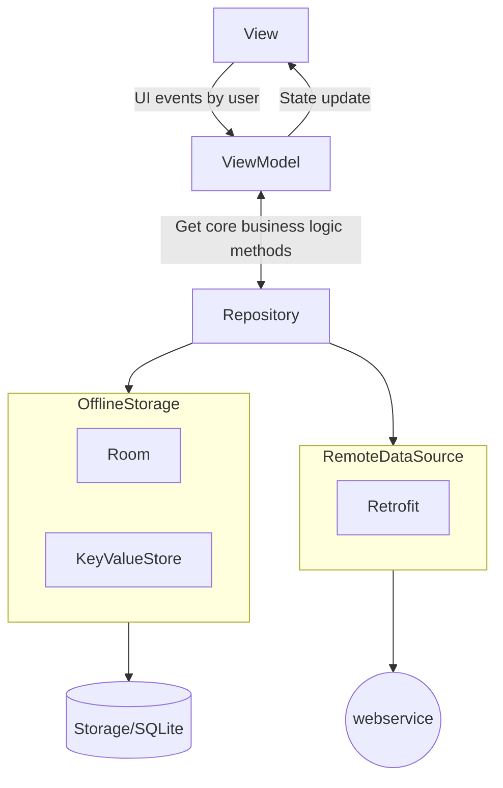

## MVVM
- model, view, view-model


## Unidirectional data flow
- view sends user initiated events to viewmodel and then viewmodel updates UI states accordingly
- view observes state and one-off events from viewmodel
- repository/use cases holds core business logic; for example when user login, this is flow of events
	- user clicks login button
	- login button click event received in viewmodel, login method from repository called and wait for the result(set state to loading and wait until error or success is returned from repository method)
	- repository method initiates API POST call to authenticate; The api returns success and authToken in response; repository method saves the authToken in encrypted key-value store and then return success
	- viewmodel gets success returned from repository method; viewmodel sends one-off event of login success
	- UI observing one-off events from viewmodel gets teh login success event and navigates to another app screen

### Compose, ViewModel implementation
```kotlin
/**
 * One-off events
 */
sealed class Effect {
	class LoginFailed(errorMessage: String) : Effect()
	object LoginSuccessful: Effect()
}

/**
 * State variables of screen
 */
data class State(
	val userName: String = "",
	val password: String = "",
	val passwordVisible: Boolean = false,
	val isLoading: Boolean = false
)
/**
 * User initiated actions
 */
sealed class Action {
	data class SetUsername(val value: String) : Action()
	data class SetPassword(val value: String) : Action()
	object SwitchPasswordVisibility : Action()
	object Login : Action()
}

/**
 * Viewmodel
 */
class LoginViewModel(private val authUseCase: AuthUseCase): ViewModel(){
	val state: MutableStateFlow<State>
		field = MutableStateFlow(State())

	private val effects = Channel<Effect>(UNLIMITED)

	private val actionFlow = MutableSharedFlow<Action>(UNLIMITED)

	init{
		if(authUseCase.isPreviouslyLoggedIn())
			viewModelScope.launch {
				effects.send(Effect.LoginSuccessful)
			}
		actionFlow.onEach { action ->
			when(action) {
				is Action.SetUsername ->
					state.value = state.value.copy(userName =  it.value)
				is Action.SetPassword ->
					state.value = state.value.copy(password =  it.value)
				is Action.SwitchPasswordVisibility ->
					state.value = state.value.copy(passwordVisible = !state.value.passwordVisible)
				is Action.Login ->
					login()
			}
		}.launchIn(viewModelScope)
	}

	fun login() =viewModelScope.launch {
		state.value = state.value.copy(isLoading = true)

		val result = authUseCase.login(LoginPayload(state.value.userName, state.value.password))

		if(result is DataResult.Error)
			effects.send(Effect.LoginFailed(getLocalizedErroMessage(result.errorCode))
		if(result is DataResult.Success)
			effects.send(Effect.LoginSuccessful)

		state.value = state.value.copy(isLoading = false)
	}

	fun processAction(action: Action) =
		actionFlow.tryEmit(action)
	
	fun effectFlow() = effects.receiveAsFlow()
}

/**
 * In navigation code
 */
@Composable
fun LoginDestination(){
    val viewModel: LoginViewModel by viewModel()
	LoginScreen(
	   loginState = viewModel.state.collectAsState().value,
	   effects = viewModel.effects.receiveAsFlow(),
	   processAction = { viewModel.processAction(it) },
	   goToForgotPasswordScreen = { navigator.navigate(MainScreenDestination) }
   )
}
 
/**
 * View
 */
@Composable
fun LoginScreen(
    loginState: State,
    effects: Flow<Effect>,
    processAction: (Action) -> Unit,
    goToForgotPasswordScreen: () -> Unit
){
	...
	LaunchedEffect(effects) {
		effects.onEach { effect ->
			if (effect is Effect.LoginFailed)
				snackBarState.showSnackBar(message = effect.errorMessage)
			else if(effect is Effect.LoginSuccessful)
				goToForgotPasswordScreen()
		}.collect()
	}
	...
	Button3(
		onClick = { processAction(Action.Login) },
		enabled = !loginState.isLoading
	) {
		if (loginState.isLoading)
			CircularProgressIndicator()
		else
			Text(text = stringResource(R.string.login))
	}
}
```